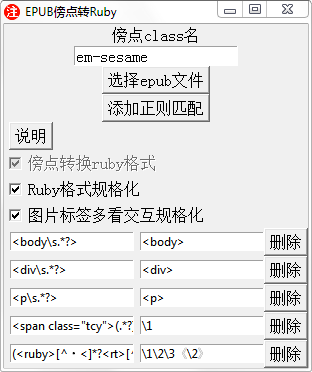

# EPUB傍点转Ruby工具

## 项目概述
用于规格化?处理日语EPUB的工具，主要功能是将em-sesame/em-dot样式的傍点转为Ruby标签格式。2.0丰富了更多的功能自动处理

## 主要功能
- 傍点转Ruby：将指定class的span标签转换为标准ruby标签
- 正则预处理：支持自定义正则规则清理HTML标签样式
- 图片处理：转换图片格式并规范化图片标签 支持webp png jpg
- 章节合并：根据目录结构合并XHTML文件
- 批量转换：支持同时处理多个EPUB文件
- EPUB版本转换：将EPUB3.0转换为EPUB2.0格式
- 样式管理：清理原有样式并添加自定义CSS
- 支持删除空行和限制连续空行数量

## 文件结构
```
sesame-to-ruby/
├── sesame-to-ruby.py      # 主程序 考虑过内部功能某些分出py...不过感觉屎山会出问题 考虑中
├── epub_ncx_generator.py  # NCX生成和EPUB版本转换
├── regex_manager.py       # 界面正则规则等功能按钮
├── tooltip.py             # 界面悬浮提示公用函数
├── image_converter.py     # 图片转换处理 nuitka编译单文件image_converter.exe
├── style.css              # 会导入的自定义样式表
└── config.ini             # 会自动生成ini配置文件 可进行保存
```

## 使用说明
1. 运行主程序：`python sesame-to-ruby.py`
2. 选择EPUB文件或使用批量转换功能
3. 根据需要配置转换选项：
   - 指定傍点class名称(默认em-sesame|em-dot)
   - 设置图片转换参数
   - 编辑正则替换规则 需要亲自确认清楚需要哪些正则
   - 删除空行与限制连续空行：下拉框中选择需要删除的空行数量和允许的最大连续空行数
4. 开始转换并保存结果

## 执行流程
1. 解压EPUB到临时目录
2. 处理OPF文件和样式表
3. 生成NCX目录(EPUB2.0)
4. 处理XHTML内容：
   - Ruby标签规范化
   - 正则替换
   - 傍点转换
   - 图片处理
5. 合并章节(可选)
6. 重新打包EPUB

## 注意事项
- 处理前请检查EPUB结构，过于奇葩的epub可能会出问题...样品征集中
- 图片标签规格化 需要更多的样品验证
- gaiji ruby内的图片文字 class名gaiji 会放出ruby标签前面


---

### 1.0版本内容
~~# epub傍点变换~~
~~epub傍点变换~~
~~基础功能是将em-sesame样式着重号转变成ruby样式的·.py附加了很多的功能方便自己自动化处理epub，单一转换功能做了个sigil0.9.8的插件可以直接执行~~

~~使用前请检查epub格式有没有什么奇葩问题,例如ruby标签前前后后有奇怪的标签可能会导致报错~~

~~图片标签功能对日语epub独特的用图片代替一个文字地方出问题，处理的时候请检查图片目录有没有相关的文字图片~~

~~        基础功能:~~
~~        1.傍点class名称需要确认~~
~~        2.图片处理可能会不正确,图片处理是在正则匹配之后执行,~~
~~        请确认处理后的epub.日语epub有些会用图片替用文字标点~~
~~        导致脚本出问题,特别是把图片代替文字放在ruby内会直删~~
~~        建议查看epub内的图片对照内容.手动编辑掉这些奇葩玩意~~
~~        3.ruby处理是删掉了多余的rb代码并且合并多个rt规格化不让其造成~~
~~        后面ruby兼容正则变换的混乱~~

~~好像ebooklib会强行把epub变成epub3.0  暂时没想到解决方法,手动修改就行了~~

~~   ~~
